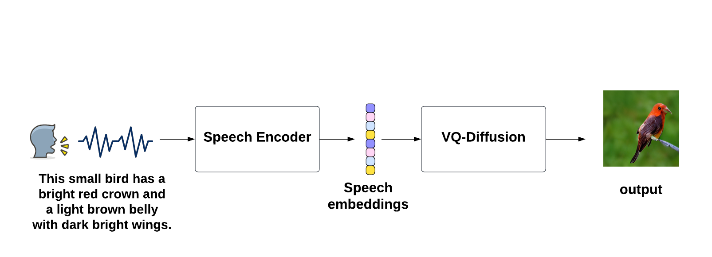

# Speak the Art 
This is the official implementation for our model S2IVQ-D. It is a direct speech-to-image generation framework

## Framework

## Training and Inference
To train or try our model, you can follow the steps in 
## Results
- CUB-200

| **Method**    | **Input** | **FID ↓**     | **IS ↑**             |
|-------------|---------------|-----------|---------------|----------------------|
|   StackGAN-v2   | text      | 15.30         | 4.04 ± 0.05          |
| AttnGAN       | text      | -             | 4.36 ± 0.03          |
| MirrorGAN     | text      | -             | 4.56 ± 0.05          |
| SEGAN         | text      | -             | 4.67 ± 0.04          |
| VQ-Diffusion  | text      | 10.32         | -                    |
| Li et al.     | speech    | 18.37         | 4.09 ± 0.04          |
| StackGAN-v2   | speech    | 18.94         | 4.14 ± 0.04          |
| S2IGAN        | speech    | 14.50         | 4.29 ± 0.04          |
|Fusion-S2iGan | speech    | 13.09         | **5.06 ± 0.09** |
| S2IVQ-D       | speech    | **9.76** | 4.07  ± 0.05         |

- Flickr8k

| **Method**    | **Input** | **FID ↓**      | **IS ↑**            | **R@50 ↑**     |
|---------------|-----------|----------------|---------------------|----------------|
| AttnGAN       | text      | 84.08          | 12.37 ± 0.41        | **50.40** |
| StackGAN-v2   | speech    | 101.74         | 8.36 ± 0.39         | 16.40          |
| S2IGAN        | speech    | 93.29          | 8.72 ± 0.34         | 16.40          |
| Fusion-S2iGan | speech    | 70.80          | 11.70 ± 0.45        | 34.95          |
| S2IVQ-D       | speech    | **31.15** | **12.3 ± 0.6** | 43.46          |

## Acknowledgment
Thanks to everyone who makes the data, code and models available

 - [VQ-Diffusion](https://github.com/microsoft/VQ-Diffusion)
 - [S2IGAN](https://github.com/xinshengwang/S2IGAN)
 - [SpeechCLIP](https://github.com/atosystem/SpeechCLIP)
 - [FID pytorch](https://github.com/mseitzer/pytorch-fid)
 - [Direct Speech-to-Image Transaltion](https://github.com/smallflyingpig/speech-to-image-translation-without-text)
